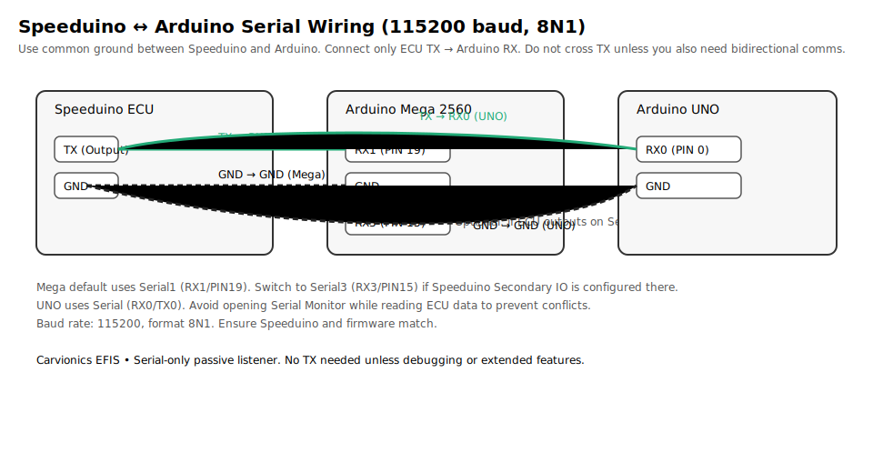

# Carvionics EFIS - Speeduino Avionics Display

**Aircraft cockpit-style passive engine display untuk Speeduino ECU**

> Proyek PlatformIO Arduino (C++) lengkap dengan desain OOP untuk real-time engine monitoring menggunakan TFT display 320×240 bergaya avionics EFIS.

---

## 📋 Daftar Isi

- [Overview](#overview)
- [Hardware Requirements](#hardware-requirements)
- [Software Architecture](#software-architecture)
- [Installation & Build](#installation--build)
- [Usage & Configuration](#usage--configuration)
- [UI Design & States](#ui-design--states)
- [Data Format & Protocol](#data-format--protocol)
- [Development Guide](#development-guide)
- [Troubleshooting](#troubleshooting)
 - [Secondary Serial Quick Guide](SECONDARY_SERIAL.md)

---

## Overview

Carvionics EFIS adalah sistem display motor otomotif yang dirancang khusus untuk Speeduino ECU. Sistem ini:

- ✅ **Passive Listener**: Hanya membaca data Speeduino via serial, tidak mengirim apapun ke ECU (autodetect Binary atau Secondary Serial Generic Fixed)
- ✅ **OOP Architecture**: Modular, extensible, maintainable
- ✅ **Real-time Monitoring**: Update rate 20Hz dengan dirty-flag optimization
- ✅ **Safety-Critical**: State machine untuk deteksi sync loss & recovery
- ✅ **Avionics Style UI**: Kontras tinggi, hirarki warna GREEN/AMBER/RED
- ✅ **Dual Platform**: Arduino Mega 2560 (primary) & Arduino Uno (optimized)

### Key Features

| Feature | Deskripsi |
|---------|-----------|
| **RPM Display** | Primary field, ukuran besar, dominan di UI |
| **Engine Core** | CLT, AFR, MAP, Battery dalam 4-quadrant layout |
| **Control Data** | TPS, IAT, frame counter, sync status |
| **State Machine** | NO_DATA → NORMAL → CAUTION → WARNING → SYNC_LOSS → RECOVERY |
| **Blink Alert** | Blink merah penuh-layar untuk SYNC_LOSS |
| **Data Validation** | Timeout detection, threshold checks, sync counter |
| **Dirty Flags** | Anti-flicker optimization dengan per-slice redraw |

---

## Hardware Requirements

### Minimum Setup

```
┌─────────────────────┐
│  Arduino Mega 2560  │  ← Recommended (8KB RAM, 248KB Flash)
│  (ATmega2560)       │
└─────────────────────┘
         ↓
┌─────────────────────────────────────────┐
│  TFT 2.4" Display 320×240               │
│  8-bit Parallel Interface               │
│  ILI9325/ILI9341 Controller             │
│  Requires: MCUFRIEND_kbv driver         │
└─────────────────────────────────────────┘
         ↓
┌─────────────────────┐
│  Speeduino ECU      │
│  Serial Output      │ (115200 baud, 8N1)
│  (TX → Mega RX1)    │
└─────────────────────┘
```

### Hardware Specifications

| Component | Spec | Notes |
|-----------|------|-------|
| **MCU** | ATmega2560 16MHz | Mega: 8KB SRAM, Uno: 2KB SRAM |
| **TFT** | 2.4" 320×240 | 8-bit parallel (16-pin data) |
| **Serial** | 115200 baud, 8N1 | Passive read-only |
| **Power** | USB atau external 7-12V | Display: 5V regulated |
| **RAM Usage** | ~1.4 KB (Mega), ~1.2 KB (Uno) | Heap: minimal allocation |
| **Flash Usage** | ~16 KB | Space untuk user logic |

### Wiring (Arduino Mega)

```
MCUFRIEND TFT Pinout → Arduino Mega
════════════════════════════════════

Data Lines (8-bit):
  D0  → A0
  D1  → A1
  D2  → A2
  D3  → A3
  D4  → A4
  D5  → A5
  D6  → A6
  D7  → A7

Control Lines:
  WR  → A8 (Write Enable)
  RD  → A9 (Read Enable)
  RS  → A10 (Register Select)
  CS  → A11 (Chip Select)
  RST → A12 (Reset)

Power:
  VCC → 5V (regulated)
  GND → GND

Serial (Speeduino):
  ECU TX → Mega RX1 (PIN 19) [default]
  ECU GND → GND
  (Opsional) Jika Speeduino memakai Secondary IO di Serial3, pindah ke Mega RX3 (PIN 15) dan sesuaikan port di kode

Catatan Shield vs Breakout:
- Jika Anda menggunakan shield MCUFRIEND 2.4" untuk Mega/UNO, pin sudah dirutekan oleh shield dan biasanya tidak perlu wiring manual. Cukup pasang shield ke board.
- Mapping di atas ditujukan untuk modul/breakout paralel 8-bit. Library `MCUFRIEND_kbv` akan mendeteksi controller (ILI93xx, dsb.) dan menggunakan jalur default.

### Wiring (Arduino Uno)

Untuk shield MCUFRIEND yang menempel langsung ke UNO, tidak diperlukan wiring manual (shield menghubungkan pin kontrol/data secara otomatis). Jika memakai breakout TFT paralel 8-bit, ikuti mapping pabrik breakout Anda atau adaptor yang sesuai.

Serial (Speeduino):
```
ECU TX  → UNO RX0 (PIN 0)
ECU GND → GND
Baud    → 115200 (8N1)
```

Port Serial di firmware:
- UNO menggunakan `Serial` (berbagi dengan Serial Monitor). Saat pengujian, pastikan tidak membuka Serial Monitor bersamaan agar tidak bentrok.
- Mega menggunakan `Serial1` (default RX1/PIN 19). Dapat diubah ke `Serial3` (RX3/PIN 15) jika diperlukan.

Referensi tambahan:
- Lihat [SECONDARY_SERIAL.md](SECONDARY_SERIAL.md) untuk pengaturan Generic Fixed (CSV) dari Speeduino.
- Jika Anda memakai varian SPI TFT (bukan paralel), lihat [WIRING_GUIDE.md](WIRING_GUIDE.md).

#### Skema Serial Speeduino ↔ Arduino



Skema menunjukkan koneksi inti:
- ECU TX → Arduino RX (Mega: RX1/PIN 19, opsi RX3/PIN 15; UNO: RX0/PIN 0)
- ECU GND → Arduino GND (ground bersama)
- Baud 115200, 8N1. Pastikan Speeduino dan firmware seragam.
```

---

## Software Architecture

### Class Hierarchy

```
ECUData
├─ Data storage untuk semua parameter motor
├─ timestamp tracking untuk stale detection
└─ debug output

SpeeduinoParser
├─ Serial frame decoder (binary, offset-based)
├─ Non-blocking state machine
├─ Frame validation & sanity checks
└─ Statistics tracking

SyncManager
├─ State machine (NO_DATA/NORMAL/CAUTION/WARNING/SYNC_LOSS/RECOVERY)
├─ Threshold evaluation
├─ Recovery delay logic
└─ State transition logging

DisplayManager
├─ MCUFRIEND_kbv wrapper
├─ Color palette (EFIS-compliant)
├─ Primitive drawing functions
└─ Helper methods (drawBox, drawParameterBox)

UIStateMachine
├─ Dirty flag management (per-slice)
├─ Blink state untuk SYNC_LOSS
├─ Rendering orchestration
└─ State change detection

UIScreen
├─ Slice rendering (Header, RPM, Engine Core, Control, Footer)
├─ Layout constants (pixel coordinates)
├─ Parameter formatting
└─ Full-screen SYNC_LOSS override
```

### Design Patterns

#### 1. **State Machine (SyncManager)**
```
      [NO_DATA] ← Timeout / belum ada data
        ↓
      [NORMAL]
        ↓ ↑
      [CAUTION]
        ↓ ↑
      [WARNING]
        ↓
    [SYNC_LOSS] ← Timeout, counter change
        ↓
    [RECOVERY] ← Fixed 2s delay
        ↓
      [NORMAL]
```

#### 2. **Dirty Flags (UIStateMachine)**
```
Setiap slice punya 1 bit dalam dirty_flags_:
  Bit 0: HEADER
  Bit 1: RPM_FIELD
  Bit 2: ENGINE_CORE
  Bit 3: CONTROL_DATA
  Bit 4: FOOTER
  Bit 5: FULL_SCREEN
```

#### 3. **Non-blocking Parser**
```
loop() {
  while (Serial.available()) {
    byte = Serial.read();
    if (state == IDLE && byte == 0xAA) → state = HEADER_FOUND
    else if (state == HEADER_FOUND) → state = COLLECTING_DATA
    if (buffer_index >= FRAME_SIZE) → state = FRAME_READY
  }
  if (state == FRAME_READY) → validate() + extract() + reset()
}
```

---

## Installation & Build

### 1. Prerequisites

```bash
# Install PlatformIO (via VS Code extension atau CLI)
python -m pip install platformio

# Verify installation
platformio --version
```

### 2. Clone/Extract Project

```bash
git clone https://github.com/carvionics/efis-display.git
cd Carvionics
```

### 3. Build untuk Target

**Arduino Mega 2560 (Recommended):**
```bash
pio run -e megaatmega2560
```

**Arduino Uno (Memory-Optimized):**
```bash
pio run -e uno
```

### 4. Upload ke Board

**Mega 2560:**
```bash
pio run -e megaatmega2560 -t upload
# Set COM port in platformio.ini [env:megaatmega2560]
```

**Uno:**
```bash
pio run -e uno -t upload
# Set COM port in platformio.ini [env:uno]
```

### Build Output

```
Arduino Mega 2560:
  RAM:   [==        ]  16.7% (used 1372 bytes from 8192 bytes)
  Flash: [=         ]   6.4% (used 16280 bytes from 253952 bytes)

Arduino Uno:
  RAM:   [======    ]  59.3% (used 1215 bytes from 2048 bytes)
  Flash: [=====     ]  48.4% (used 15598 bytes from 32256 bytes)
```

---

## Usage & Configuration

### Basic Startup Sequence

```cpp
// main.cpp loop overview
void loop() {
  // 1. Read serial frame dari Speeduino (non-blocking)
  parser.update(ecu_data);
  
  // 2. Evaluate engine state vs thresholds
  sync_manager.update(ecu_data);
  
  // 3. Update UI state & dirty flags
  ui_state_machine.update(sync_manager.getState());
  
  // 4. Render hanya slice yang dirty
  ui_screen.render(ecu_data, sync_manager, ui_state_machine);
  
  // 5. Mark slices as clean untuk next cycle
  ui_state_machine.markSliceClean(...);
  
  // 6. Debug output every 5 seconds
  if (elapsed > 5000) {
    ecu_data.debugPrint();
    parser.debugPrint();
    sync_manager.debugPrint();
  }
}
```

### Configuration (Thresholds)
### Speeduino Secondary IO (Generic Fixed)

Untuk menggunakan Generic Fixed (CSV):
- Enable Secondary Serial IO Interface di TunerStudio.
- Pilih Generic Fixed output (simple atau enhanced sesuai kebutuhan).
- Pastikan Speeduino mengirim ke port serial yang sama dengan yang didengarkan firmware:
  - Mega 2560 default: Serial1 (RX1/19). Opsional: ganti ke Serial3 (RX3/15) jika ECU mengirim di Serial3.
  - Uno: Serial (shared). Hindari konflik dengan Serial Monitor saat uji.
- Urutan field default yang diharapkan: RPM, MAP, TPS, CLT, IAT, AFR, BAT. Jika urutanmu berbeda, mapping dapat disesuaikan di parser tanpa mengubah API.

Kebijakan tampilan:
- Hanya field yang diterima yang akan ditampilkan; field yang tidak tersedia akan muncul sebagai “—”. Tidak ada perhitungan atau estimasi.


Di `main.cpp` setup():

```cpp
SyncManager::Thresholds thresholds;
thresholds.rpm_max = 8000;              // Max RPM
thresholds.clt_min = 10;                // Min CLT (°C)
thresholds.clt_max = 110;               // Max CLT (°C)
thresholds.afr_min = 1200;              // Min AFR (12.00:1, 100x)
thresholds.afr_max = 1700;              // Max AFR (17.00:1, 100x)
thresholds.battery_min = 11000;         // Min battery (mV)
thresholds.data_timeout_ms = 500;       // Stale timeout
thresholds.recovery_delay_ms = 2000;    // Recovery stabilization

sync_manager.setThresholds(thresholds);
```

### Parameter Ranges

| Parameter | Min | Max | Unit | Default |
|-----------|-----|-----|------|---------|
| RPM | 0 | 15000 | RPM | 0 |
| CLT | -40 | 120 | °C | 0 |
| AFR | 1000 | 2000 | 100x:1 | 1400 (14:1) |
| MAP | 0 | 255 | kPa | 0 |
| TPS | 0 | 100 | % | 0 |
| IAT | -40 | 120 | °C | 0 |
| Battery | 0 | 16000 | mV | 12000 |

---

## UI Design & States

### Display Layout (320×240)

```
┌────────────────────────────────────────┐
│ [●] STATUS [STATE] SYNC:N              │  ← Header (30px, GREEN)
├────────────────────────────────────────┤
│                                        │
│            5250 RPM                    │  ← RPM Field (90px, DARK_GRAY)
│                                        │
├──────────────────┬─────────────────────┤
│ CLT    AFR       │ MAP    BATT         │  ← Engine Core (60px)
│ 92 C   14.5:1    │ 45 kPa  12.5V       │
├──────────────────┼─────────────────────┤
│ TPS    IAT       │ FRAMES              │  ← Control Data (40px, CYAN)
│ 25%    28 C      │ S:0                 │
├────────────────────────────────────────┤
│ DATA OK                    T:1234 ms   │  ← Footer (20px, DARK_GRAY)
└────────────────────────────────────────┘
```

### Color Hierarchy

```
Status Indicator (●):
  GREEN   → Synced & OK
  AMBER   → Synced but caution
  RED     → Warning or no sync

Field Borders:
  GREEN   → Normal operation
  AMBER   → Caution threshold
  RED     → Warning threshold

Background:
  BLACK   → Default
  DARK_GRAY → Boxes & sections
  RED     → Full-screen SYNC_LOSS (blinking)

Text:
  WHITE   → Primary info
  GREEN   → Success/normal
  AMBER   → Warning
  RED     → Critical
  CYAN    → Auxiliary data
```

### State Transitions

```
NORMAL (GREEN)
  ├─ All parameters within safe range
  ├─ Data fresh (< 500ms old)
  └─ Sync counter unchanged
  
CAUTION (AMBER)
  ├─ 1 parameter in caution band
  └─ Display active, no blinking
  
WARNING (RED)
  ├─ ≥2 parameters out of range OR ≥1 in danger zone
  └─ All fields visible (no override)
  
SYNC_LOSS (RED BLINK)
  ├─ Data timeout (> 500ms) OR
  ├─ Sync counter increment OR
  ├─ Multiple critical failures
  └─ FULL SCREEN OVERRIDE (red ↔ black blinking)
  
RECOVERY (AMBER)
  ├─ After SYNC_LOSS resolved
  ├─ Stabilization wait (2 seconds)
  └─ Progress bar visible
  └─ Return to NORMAL after delay
```

---

## Data Format & Protocol

### Speeduino Binary Frame

```
Frame Structure (128 byte):
┌─────────┬──────────┬──────────┬──────────┐
│ Header  │ Data     │ Data     │ ...      │
│ 1 byte  │ 127 byte │          │          │
│ 0xAA    │ (offset-based)       │          │
└─────────┴──────────┴──────────┴──────────┘

Data Offsets (from Speeduino v20+):
  0-1:   RPM (uint16_t, little-endian)
  2:     CLT (int8_t, °C)
  4-5:   AFR (uint16_t, little-endian, 100x)
  6:     MAP (uint8_t, kPa)
  10:    TPS (uint8_t, %)
  14:    IAT (int8_t, °C)
  20:    Battery (uint8_t, 0.1V per unit → mV)
  31:    Status (uint8_t, bit 0 = sync)
```

### Secondary Serial: Generic Fixed (CSV)

Firmware ini juga mendukung output Secondary Serial “Generic Fixed” (CSV) dari Speeduino. Parser akan mengumpulkan satu baris ASCII hingga newline dan memetakan nilai sesuai urutan tetap umum berikut:

Urutan field (asumsi umum, dapat disesuaikan):
- 0: RPM (integer, RPM)
- 1: MAP (integer, kPa)
- 2: TPS (integer, %)
- 3: CLT (integer, °C)
- 4: IAT (integer, °C)
- 5: AFR (float mis. 14.7 atau 100x mis. 1470)
- 6: Battery (float volt mis. 12.5 atau 0.1V mis. 123 → 12.3V)

Aturan skala dan validasi:
- AFR: Jika < 50 → dianggap voltase float (14.7 → 1470 internal 100x). Jika > 50 → diasumsikan sudah 100x.
- Battery: Jika 0..30 → volt (12.5V → 12500 mV). Jika 0..160 → 0.1V (123 → 12.3V). Jika < 30000 → mV.
- Plausibility check hanya diterapkan untuk field yang tersedia.

Ketersediaan field (sesuai preferensi “Generic Fixed”):
- Parser hanya mengisi field yang ada di baris CSV.
- Field yang tidak ada dibiarkan apa adanya sehingga UI menampilkan “—” (tanpa estimasi).

Port Serial yang digunakan:
- Mega 2560: default mendengarkan di Serial1 (RX1 / PIN 19). Jika Secondary IO Speeduino dikonfigurasi di Serial3, pindah wiring ke RX3 (PIN 15) dan ganti pemanggilan `parser.begin(Serial3)` di kode.
- Uno: memakai Serial (shared dengan Serial Monitor), pastikan tidak bentrok dengan monitor saat pengujian.

Cara mengaktifkan Secondary IO di Speeduino (ringkas):
1. Buka TunerStudio → Enable Secondary Serial IO Interface.
2. Pilih mode Generic Fixed sesuai pilihan.
3. Set baud rate: 115200, format 8N1.
4. Pastikan daftar field sesuai atau sesuaikan mapping di firmware bila perlu.

### Parser State Machine

```
State: IDLE
  Input: any byte
  Action: if byte == 0xAA → HEADER_FOUND, buffer[0] = 0xAA, idx = 1
  
State: HEADER_FOUND
  Input: next byte
  Action: buffer[1] = byte, idx = 2, → COLLECTING_DATA
  
State: COLLECTING_DATA
  Input: byte stream
  Action: buffer[idx++] = byte
  Condition: if idx >= 128 → FRAME_READY
  
State: FRAME_READY
  Action: validate() → if pass: extract() + stats++ + IDLE
          if fail: error++ + IDLE (resync)
```

---

## Development Guide

### Adding New Parameters

1. **ECUData.h**:
   ```cpp
   class ECUData {
   public:
       uint16_t new_param;  // Add here
   };
   ```

2. **SpeeduinoParser.cpp**:
   ```cpp
   static constexpr uint8_t OFFSET_NEW_PARAM = 25;
   
   void SpeeduinoParser::extractDataFromFrame_(ECUData &ecu_data) {
       ecu_data.new_param = frame_buffer_[OFFSET_NEW_PARAM];  // Add extraction
   }
   ```

3. **SyncManager.h & .cpp**:
   ```cpp
   struct Thresholds {
       uint16_t new_param_min, new_param_max;  // Add thresholds
   };
   void evaluateThresholds_(const ECUData &ecu_data) {
       // Add check
   }
   ```

4. **UIScreen.cpp**:
   ```cpp
   void renderEngineCore_(...) {
       // Add rendering code
   }
   ```

### Modifying Thresholds Dynamically

Jika ingin dynamic tuning via serial:

```cpp
void handleSerialCommand() {
    if (Serial.available()) {
        char cmd = Serial.read();
        if (cmd == 't') {  // "t" untuk tuning
            int value = Serial.parseInt();
            SyncManager::Thresholds t = sync_manager.getThresholds();
            t.rpm_max = value;
            sync_manager.setThresholds(t);
        }
    }
}
```

### Memory Optimization Tips

```cpp
// ❌ AVOID (uses dynamic heap)
char buffer[256];
String msg = "RPM: " + String(rpm);

// ✅ PREFER (stack allocation)
char buffer[64];
snprintf(buffer, 64, "RPM: %d", rpm);
display_.print(buffer);

// Use static buffers untuk state strings
const char* PROGMEM state_names[] = { "NORMAL", "CAUTION", ... };
```

---

## Troubleshooting

### Build Issues

**Error: "MCUFRIEND_kbv.h not found"**
- Solution: Display manager memiliki fallback mock class untuk kompile tanpa hardware
- File: `include/DisplayManager.h` (ada `#ifdef MCUFRIEND_KBV_H`)

**Error: "Serial1 not declared" (Uno)**
- Solution: Conditional compilation di `main.cpp`:
  ```cpp
  #ifdef ARDUINO_AVR_MEGA2560
    parser.begin(Serial1);
  #else
    parser.begin(Serial);
  #endif
  ```

**Flash Size Warning (Uno)**
- 48.4% flash usage untuk Uno normal
- Kurangi debug output: hapus `debugPrint()` calls di loop jika memory critical

### Runtime Issues

**Data Not Updating**
1. Check baud rate: 115200 baud
2. Verify wiring: ECU TX → Mega RX1 (PIN 19) atau RX3 (PIN 15) jika pakai Serial3
3. Cek apakah output Speeduino Binary (0xAA) atau Generic Fixed (CSV). Jika CSV, pastikan newline terkirim per baris.
4. Enable debug: `parser.debugPrint();` untuk cek statistik parser.

**Display Blank**
1. Verify TFT wiring (16 pin data + 5 control)
2. Check power: TFT needs regulated 5V
3. Test MCUFRIEND detection: `tft_.readID()` returns valid ID?
4. Try `display_.fillScreen(DisplayManager::Color::GREEN)` untuk test

**Sync Loss Stuck**
1. Recovery delay 2 seconds - normal jika repeatedly
2. Check threshold values - mungkin terlalu strict
3. Inspect sync counter: `ecu_data.syncLossCounter` increment normal?
 4. Untuk Generic Fixed, pastikan interval kirim CSV cukup stabil (tanpa jeda terlalu lama)

**Performance/Lag**
- Rendering rate capped di 50ms (20Hz) via `RENDER_INTERVAL_MS`
- Dirty flags optimization mencegah flicker
- Jika masih lambat: reduce debug output atau increase interval

---

## Project Structure

```
Carvionics/
├── platformio.ini                 # Build configuration
├── src/
│   ├── main.cpp                   # Application entry point
│   └── lib/                       # Implementation files
│       ├── ECUData.cpp
│       ├── SpeeduinoParser.cpp
│       ├── SyncManager.cpp
│       ├── DisplayManager.cpp
│       ├── UIStateMachine.cpp
│       └── UIScreen.cpp
├── include/                       # Header files
│   ├── SimpleLCD.h                # Library umbrella header
│   ├── ECUData.h
│   ├── SpeeduinoParser.h
│   ├── SyncManager.h
│   ├── DisplayManager.h
│   ├── UIStateMachine.h
│   └── UIScreen.h
├── lib/
│   └── SimpleLCD/                 # Library folder
│       ├── library.json
│       ├── library.properties
│       └── SimpleLCD.cpp           # Deprecated (moved to src/lib/)
└── README.md                      # This file
```

---

## License

MIT License - Bebas untuk personal, commercial, educational use

## Support

- Issues: GitHub Issues
- Documentation: See inline comments di source code
- Serial Debug: Enable via `debugPrint()` calls

---

**Last Updated**: 25 December 2025  
**Version**: 3.0.0  
**Status**: Production Ready ✅

## 📋 Features

- ✅ **Real-time Engine Monitoring**
  - RPM display (large, easy-to-read)
  - Coolant temperature (CLT)
  - Intake air temperature (IAT)
  - Air-Fuel Ratio (AFR) monitoring
  - Manifold Absolute Pressure (MAP/Boost)
  - Battery voltage
  - Throttle position (TPS)
  - Sync loss counter

- ✅ **Avionic-Style Interface**
  - Aircraft-inspired layout
  - Color-coded warnings
  - Real-time status indicator
  - Dual-column information display
  - Optimized for quick glancing

- ✅ **Smart Monitoring**
  - Automatic state detection
  - Color-changing alerts
  - Sync loss detection with recovery timer
  - No-data timeout handling
  - Dirty flag system for efficient updates

- ✅ **Hardware Flexible**
  - Works with Arduino UNO
  - Works with Arduino MEGA 2560
  - Single codebase for both platforms
  - Hardware SPI for optimal performance

## 🛠️ Hardware Required

### Display
- **ST7735 1.8" TFT Display** (128x160 pixels)
- SPI interface
- 5V compatible

### Microcontroller (Choose One)
- **Arduino UNO** (ATmega328P, 16MHz, 32KB Flash) ⭐ Recommended for beginners
- **Arduino MEGA 2560** (ATmega2560, 16MHz, 256KB Flash) ⭐ Recommended for production

**Both platforms are fully supported!** Code compiles and runs on both with zero modifications.

### Connectivity
- **Speeduino ECU** with serial output
- **USB Serial Adapter** (optional, for future logging)

### Power Supply
- 5V / 1A+ power source
- Recommended: USB power or dedicated 5V supply

## 📦 Installation

### 1. Clone or Download
```bash
git clone https://github.com/yourusername/carvionics.git
cd Carvionics
```

### 2. Install PlatformIO
```bash
# VS Code Extension (Recommended)
# Search for "PlatformIO IDE" in Extensions

# Or via pip
pip install platformio
```

### 3. Install Libraries
Libraries are auto-installed by PlatformIO:
- Adafruit GFX Library (1.12.4+)
- Adafruit ST7735 and ST7789 Library (1.11.0+)

### 4. Hardware Wiring

#### Arduino UNO
```
ST7735 Display → Arduino UNO
┌─────────────────┐
│ VCC    → 5V     │
│ GND    → GND    │
│ CS     → Pin 10 │
│ RST    → Pin 9  │
│ DC     → Pin 8  │
│ SDA    → Pin 11 │
│ SCK    → Pin 13 │
│ LED    → 5V     │
└─────────────────┘

Speeduino ECU → Arduino Serial
┌─────────────────────┐
│ RX → Pin 0 (Serial) │
│ TX → Pin 1 (Serial) │
└─────────────────────┘
```

#### Arduino MEGA 2560
Same pin configuration applies (UNO-compatible pins)

See `WIRING_GUIDE.md` for detailed diagrams

### 5. Configuration

Edit `platformio.ini`:

```ini
[platformio]
default_envs = uno              # or megaatmega2560

[env:uno]
board = uno
monitor_port = COM3            # Adjust for your system
upload_port = COM3             # Adjust for your system
```

### 6. Build and Upload

```bash
# Build for selected environment
pio run

# Upload to board
pio run --target upload

# Monitor serial output
pio device monitor
```

Or use VS Code's PlatformIO bottom bar for easy switching between UNO and MEGA 2560.

## 📡 Speeduino Configuration

Speeduino must be configured to output serial data:

1. **Baud Rate**: 115200
2. **Data Format**: Binary protocol
3. **Output Frequency**: Continuous or on-demand
4. **USB/Serial**: Direct serial connection

Refer to Speeduino documentation for setup details.

## 🎨 Display Layout

```
┌──────────────────────────┐
│ CARVIONICS       SYN/--- │ Header (Status)
├──────────────────────────┤
│ RPM       │      MAP     │ Primary (Engine Speed / Boost)
│ 5000      │      150 kpa │
│           │              │
├──────────────────────────┤
│ CLT    │   AFR           │ Secondary (Temps & Efficiency)
│ 85 C   │   12.5          │
│ IAT    │   BAT           │
│ 28 C   │   13.8 v        │
├──────────────────────────┤
│ TPS 45%      SyncLoss: 0 │ Footer (Throttle & Diagnostics)
└──────────────────────────┘
```

## 🚨 Color Coding

| Status | Color | Meaning |
|--------|-------|---------|
| Normal | Green | Everything is OK |
| Caution | Yellow | Parameter approaching limit |
| Warning | Red | Critical parameter exceeded |
| Recovery | Yellow | Sync recovered, stabilizing |
| No Data | Yellow | No ECU communication |

### Parameter Thresholds

**Coolant Temperature (CLT)**
- Normal: < 90°C (Green)
- Caution: 90-95°C (Yellow)
- Critical: > 95°C (Red)

**Intake Air Temperature (IAT)**
- Normal: -5 to +60°C (Green)
- Caution: < -5°C or > 60°C (Yellow)

**Air-Fuel Ratio (AFR)**
- Normal: 11.5 - 15.5 (Green)
- Caution: 15.5 - 16.5 or < 11.5 (Yellow)
- Critical: > 16.5 (Red)

**Manifold Pressure (MAP)**
- Normal: < 150 kPa (Green)
- Caution: 150 - 200 kPa (Yellow)
- Critical: > 200 kPa (Red)

**Battery Voltage**
- Normal: > 12.5V (Green)
- Caution: 11.8 - 12.5V (Yellow)
- Critical: < 11.8V (Red)

## 🔧 Customization

### Adjust Thresholds

Edit in `src/main.cpp`:

```cpp
// Example: Change CLT warning threshold
uint16_t cltColor() {
  if (ecu.clt > 95) return CLR_CRIT;      // Warning at 95°C
  if (ecu.clt > 90) return CLR_WARN;      // Caution at 90°C
  return CLR_NORM;
}
```

### Change Colors

```cpp
#define CLR_NORM   ST77XX_GREEN      // Change normal color
#define CLR_WARN   ST77XX_YELLOW     // Change warning color
#define CLR_CRIT   ST77XX_RED        // Change critical color
```

### Modify Display Layout

Edit section size definitions:
```cpp
#define SL_PRIMARY_Y   16
#define SL_PRIMARY_H   60
#define SL_SECONDARY_Y 76
#define SL_SECONDARY_H 42
```

## 📚 Documentation

- **`WIRING_GUIDE.md`** - Detailed pinout and hardware setup
- **`DISPLAY_LAYOUT.md`** - Display layout and parameter mapping
- **`PLATFORMIO_GUIDE.md`** - Build system and platform switching

## 🐛 Troubleshooting

### Display not showing anything
1. Check power connections (VCC/GND)
2. Verify pin assignments in code
3. Try different display reset

### No data from Speeduino
1. Check serial cable connections
2. Verify Speeduino baud rate (115200)
3. Monitor serial output with `pio device monitor`

### Sync loss warnings constantly
1. Check Speeduino configuration
2. Verify stable USB/serial connection
3. Check signal noise on serial line

### Compilation errors
1. Ensure PlatformIO environment is correct
2. Check all libraries are installed
3. Try `pio run --target clean`

### Board not detected
1. Install Arduino drivers
2. Check USB cable quality
3. Verify correct COM port in platformio.ini

## 📈 Performance

### Arduino UNO
- **Flash Usage**: ~26 KB / 32 KB
- **RAM Usage**: ~1.5 KB / 2 KB
- **Update Rate**: ~10 Hz (100ms per update)
- **Status**: Functional, limited headroom

### Arduino MEGA 2560
- **Flash Usage**: ~26 KB / 256 KB
- **RAM Usage**: ~1.5 KB / 8 KB
- **Update Rate**: ~10 Hz (100ms per update)
- **Status**: Excellent, room for expansion

## 🚀 Future Enhancements

- [ ] Gauge graphics (analog needles)
- [ ] G-force meter
- [ ] Data logging to SD card
- [ ] Bluetooth wireless display
- [ ] Multiple display modes
- [ ] Customizable themes
- [ ] OBD-II protocol support

## 📝 License

MIT License - Feel free to use and modify

## 👥 Contributing

Contributions welcome! Please:
1. Fork the repository
2. Create feature branch (`git checkout -b feature/AmazingFeature`)
3. Commit changes (`git commit -m 'Add some AmazingFeature'`)
4. Push to branch (`git push origin feature/AmazingFeature`)
5. Open Pull Request

## 📧 Support

For issues, questions, or suggestions:
- Open an issue on GitHub
- Check existing documentation
- Review troubleshooting guide

## 🙏 Credits

- **Adafruit** - Display libraries
- **Speeduino** - ECU platform
- **Arduino** - Microcontroller framework

---

**Version**: 1.0.0  
**Last Updated**: December 2025  
**Maintainer**: YRAC  
**Status**: Active Development
